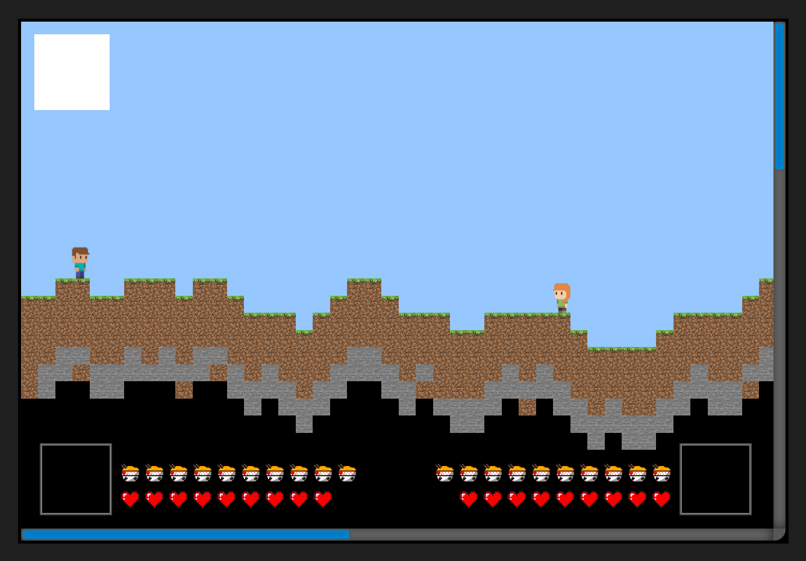
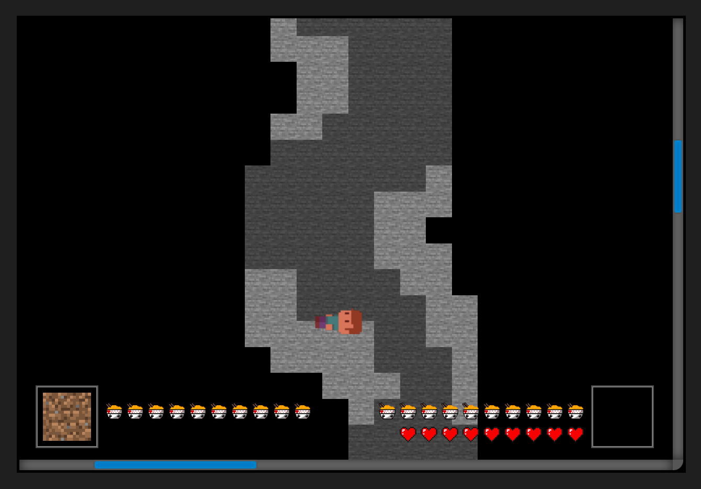
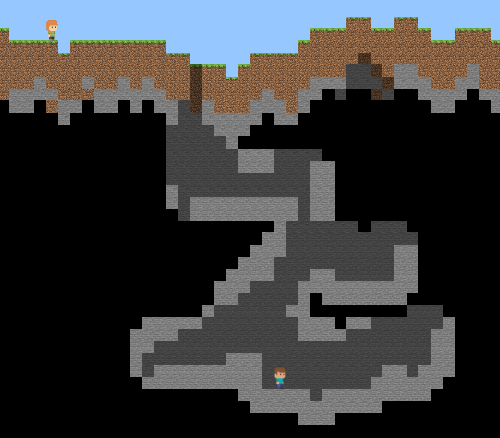

<h1>GameMine</h1>
<h3>Minecraft and Terraria Mashup</h3>
</img>

<a href="https://picsile.github.io/GameMine/Version_1.3/index.html" class="buttonTest">Link to latest version</a>

<!-- Управление -->
<h2>English</h2>
<h3>Controls for the first player:</h3>

A - move left

D - move right

W - Jump

S - Crouch

T - break block above

G - break block below

Y - break block at head level in front

H - break block at foot level in front

 
<h3>Controls for the second player:</h3>

ArrowLeft - move left

ArrowRight - move right

ArrowUp - Jump

ArrowDown - Crouch

Numpad 5 - break block above

Numpad 2 - break block below

Numpad 6 - break block at head level in front

Numpad 3 - break block at foot level in front

 

 
<h2>Русский</h2>
<h3>Управление для первого игрока:</h3>

A - шаг в лево

D - шаг в право

W - Прыжок

S - Присед

T - сломать блок над собой

G - сломать блок под собой

Y - сломать блок на уровне головы перед собой

H - сломать блок на уровне ног перед собой

 
<h3>Управление для второго игрока:</h3>

ArrowLeft - шаг в лево

ArrowRight - шаг в право

ArrowUp - Прыжок

ArrowDown - Присед

Numpad 5 - сломать блок над собой

Numpad 2 - сломать блок под собой

Numpad 6 - сломать блок на уровне головы перед собой

Numpad 3 - сломать блок на уровне ног перед собой

<!-- Version 1.4 -->
исправлен баг с неполной школой жизни
теперь при смерти инвентарь ставновится пустым
исправлен баг с сменой дня и ночи
шкала сытости со временем убывает
трещены на блоках со временем очищаются
движения также отнимают сытость
игрок может переключаться между вещами в инвентаре

игрок может ставить блоки
добавлены деревья

<!-- Version 1.3 -->
 
<h2>Version 1.3 <a href="https://picsile.github.io/GameMine/Version_1.3/index.html" class="buttonTest">Link to test</a></h2>

Snapshots:

</img>
</img>

<h3>English</h3>

Changes:

<ul>
    <li>The game now features a separate game window. It allows scrolling using scrollbars, and the block size within the window has become more adaptive (initially set to 35.5 px). Now, when scrolling the mouse wheel, you can zoom in and out of the world map, considering maximum zoom-in and zoom-out limitations. The world background adjusts automatically to match the map size.</li>
    <li>Added player health bar to track their status. Currently, players can only take damage from falls, and reaching zero health results in death. The hunger bar is introduced for visual representation but does not affect gameplay yet.</li>
</ul>

Other changes:

<ul>
    <li>The 'world' object now stores information about the time since world creation in milliseconds. (Console command: World.time)</li>
    <li>The block array has been reworked and now represents an associative array.</li>
    <li>The sun and moon are now initially positioned to the left for better visualization at the beginning of the game.</li>
    <li>Added the ability to change sea level by modifying a single variable in the code.</li>
    <li>Introduced the 'Player' class for player creation, enriched with many new properties.</li>
    <li>Styles for the website and game are separated into individual files. Player styles are isolated in a separate file.</li>
    <li>HTML structure for unit animations has been revised.</li>
</ul>
 
<h3>Русский</h3>

Крупные изменения:

<ul>
    <li>Теперь игра представляет собой отдельное игровое окно. Оно обладает возможностью прокрутки с помощью скролов, а размер блока внутри окна стал более адаптивным (изначально равен 35.5 px). Теперь при прокрутке колёсика мыши можно приближать и отдалять карту мира, с учетом ограничений максимального приближения и отдаления. Фон мира автоматически подстраивается под размеры карты.</li>
    <li>Добавлена шкала здоровья игрока, позволяющая отслеживать его состояние. В данный момент игрок может получать урон только от падений, и при нулевом здоровье может умереть. Шкала сытости введена для визуального представления, но пока не оказывает влияния на игровой процесс.</li>
</ul>

Другие изменения:

<ul>
    <li>Объект 'мир' хранит информацию о времени с момента создания в миллисекундах. (Команда в консоле: World.time)</li>
    <li>Массив блоков был переработан и теперь представляет собой ассоциативный массив.</li>
    <li>Солнце и луна теперь начально расположены левее для лучшей визуализации в начале игры.</li>
    <li>Теперь есть возможность изменять высоту мера, меняя одну переменную в коде.</li>
    <li>Введен класс 'Player', через который осуществляется создание игроков. У игрока появилось много новых свойств.</li>
    <li>Стили для веб-сайта и стили для игры разделены на отдельные файлы. Стили для игроков вынесены в отдельный файл.</li>
    <li>Также была переработана HTML конструкция для анимации юнитов.</li>
</ul>

<!-- Version 1.2 -->
 
<h2>Version 1.2 <a href="https://picsile.github.io/GameMine/Version_1.2/index.html" class="buttonTest">Link to test</a></h2>

Snapshots:

</img>
</img>

<h3>English</h3>

Changes:

<ul>
    <li>Darkness: now players will gradually reveal sections of the map to see what lies behind them.</li>
    <li>Day and night cycle: now a day and night cycle occurs every 2 minutes. The animations look as follows:</li>
    <li>Optimization: now only the block that is in the foreground or together with the background block (if the foreground block is transparent) is loaded in one cell. Also, only the blocks that the player loads or that are on the surface are displayed on the screen. Darkness is the furthest background.</li>
</ul>
 

Other changes:

<ul>
    <li>The world object has been divided into main functions: output, generation, and interaction.</li>
    <li>The cloud background has been replaced with clear sky.</li>
    <li>Changed the generation of the array of foreground and background blocks.</li>
</ul>

 
<h3>Русский</h3>

Крупные изменения:

<ul>
    <li>Темнота: теперь игрок будет постепенно открывать участки карты, чтобы увидеть, что за ними находится.</li>
    <li>Смена дня и ночи: теперь каждые 2 минуты происходит смена дня и ночи. Анимации выглядят следующим образом:</li>
    <li>Оптимизация: теперь в одной ячейке прогружается только блок, который стоит на переднем фоне или вместе с задним блоком (если передний блок прозрачный). Также на экране показываются только блоки, которые игрок прогружает или они находятся на поверхности. Темнота является самым задним фоном.</li>
</ul>

Другие изменения:

<ul>
    <li>Объект мира был разделён на основные функции: вывода, генерации и взаимодействия.</li>
    <li>Фон облаков заменён чистым небом.</li>
    <li>Изменена генерация массива передних блоков и задних блоков.</li>
</ul>

<!-- Version 1.1 -->
 
<h2>Version 1.1 <a href="https://picsile.github.io/GameMine/Version_1.1/index.html" class="buttonTest">Link to test</a></h2>

<h3>English</h3>

Changes:

<ul>
    <li>Added durability to each block, now breaking blocks requires multiple clicks.</li>
    <li>Code has been split into objects.</li>
    <li>Improved animation system, animations no longer reset after each action.</li>
    <li>Enhanced cave generation.</li>
    <li>Fixed bug with simultaneous destruction of cave blocks.</li>
    <li>Fixed crouching bug.</li>
    <li>Changed management</li>
    <li>Removed ability to place blocks.</li>
</ul>

 
<h3>Русский</h3>

Изменения:

<ul>
    <li>Добавлена прочность каждому блоку, теперь для ломки блоков требуется несколько кликов.</li>
    <li>Код был разделен на объекты.</li>
    <li>Улучшена система анимации, анимации теперь не сбрасываются после каждого действия.</li>
    <li>Улучшена генерация шахт.</li>
    <li>Исправлен баг с одновременным разрушением блоков шахт.</li>
    <li>Исправлен баг с приседанием.</li>
    <li>Изменино управление</li>
    <li>Убрана возможность ставить блоки.</li>
</ul>

<!-- Version 1 -->
 
<h2>Version 1 <a href="https://picsile.github.io/GameMine/Version_1/index.html" class="buttonTest">Link to test</a></h2>

<!--  -->