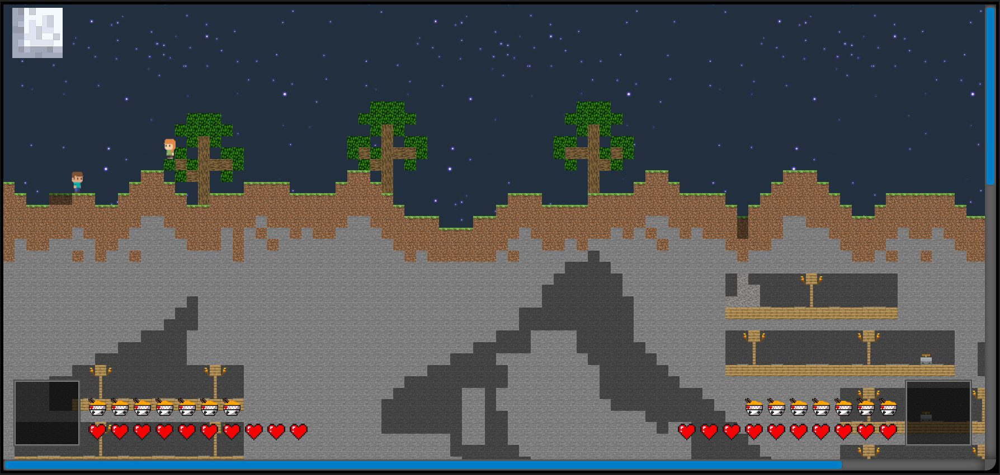

<h1>GameMine</h1>
<h3>Minecraft and Terraria Mashup</h3>
</img>

<!-- Version 1.2 -->
 
<h2>Version 1.2</h2>

Snapshots:

</img>
</img>

<h3>English</h3>

Changes:

<ul>
    <li>Darkness: now players will gradually reveal sections of the map to see what lies behind them.</li>
    <li>Day and night cycle: now a day and night cycle occurs every 2 minutes. The animations look as follows:</li>
    <li>Optimization: now only the block that is in the foreground or together with the background block (if the foreground block is transparent) is loaded in one cell. Also, only the blocks that the player loads or that are on the surface are displayed on the screen. Darkness is the furthest background.</li>
</ul>

Other changes:

<ul>
    <li>The world object has been divided into main functions: output, generation, and interaction.</li>
    <li>The cloud background has been replaced with clear sky.</li>
    <li>Changed the generation of the array of foreground and background blocks.</li>
</ul>

 
<h3>Русский</h3>

Крупные изменения:

<ul>
    <li>Темнота: теперь игрок будет постепенно открывать участки карты, чтобы увидеть, что за ними находится.</li>
    <li>Смена дня и ночи: теперь каждые 2 минуты происходит смена дня и ночи. Анимации выглядят следующим образом:</li>
    <li>Оптимизация: теперь в одной ячейке прогружается только блок, который стоит на переднем фоне или вместе с задним блоком (если передний блок прозрачный). Также на экране показываются только блоки, которые игрок прогружает или они находятся на поверхности. Темнота является самым задним фоном.</li>
</ul>

Другие изменения:

<ul>
    <li>Объект мира был разделён на основные функции: вывода, генерации и взаимодействия.</li>
    <li>Фон облаков заменён чистым небом.</li>
    <li>Изменена генерация массива передних блоков и задних блоков.</li>
</ul>

<a href="https://picsile.github.io/GameMine/Version_1.2/index.html">Link to test</a>

<!-- Version 1.1 -->
 
<h2>Version 1.1</h2>

<h3>English</h3>

Changes:

<ul>
    <li>Added durability to each block, now breaking blocks requires multiple clicks.</li>
    <li>Code has been split into objects.</li>
    <li>Improved animation system, animations no longer reset after each action.</li>
    <li>Enhanced cave generation.</li>
    <li>Fixed bug with simultaneous destruction of cave blocks.</li>
    <li>Fixed crouching bug.</li>
    <li>Changed management</li>
    <li>Removed ability to place blocks.</li>
</ul>

 
<h3>Русский</h3>

Изменения:

<ul>
    <li>Добавлена прочность каждому блоку, теперь для ломки блоков требуется несколько кликов.</li>
    <li>Код был разделен на объекты.</li>
    <li>Улучшена система анимации, анимации теперь не сбрасываются после каждого действия.</li>
    <li>Улучшена генерация шахт.</li>
    <li>Исправлен баг с одновременным разрушением блоков шахт.</li>
    <li>Исправлен баг с приседанием.</li>
    <li>Изменино управление</li>
    <li>Убрана возможность ставить блоки.</li>
</ul>

<a href="https://picsile.github.io/GameMine/Version_1.1/index.html">Link to test</a>

<!-- Version 1 -->
 
<h2>Version 1</h2>

<a href="https://picsile.github.io/GameMine/Version_1/index.html">Link to test</a>

